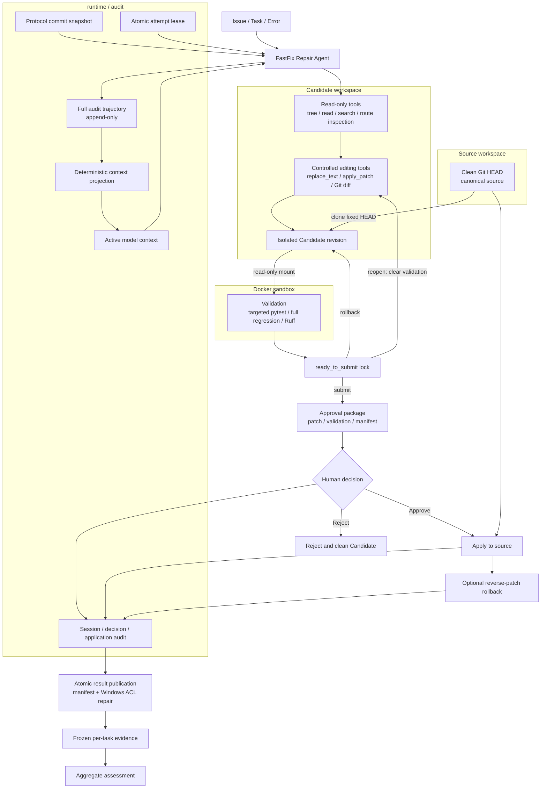
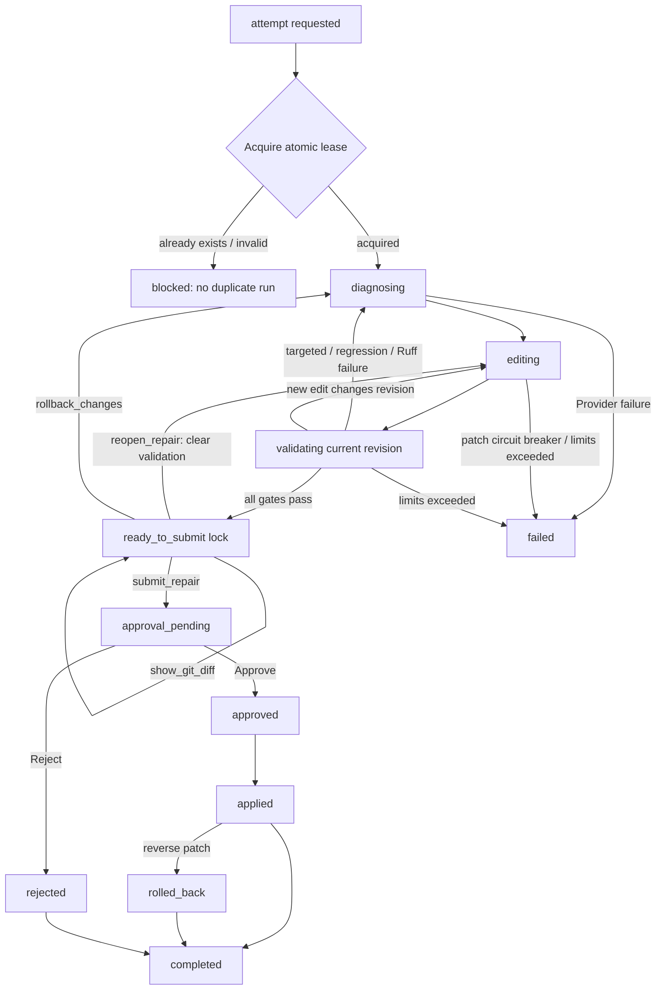

# FastFix

FastFix 是一个面向 Python/FastAPI 仓库的垂直代码故障诊断与自动修复 Agent，通过结构化工具、隔离 Candidate 工作区、Docker 验证和人工审批形成受控修复闭环。

> 本仓库是从内部基线 `71839cbe5c35b38e15e156700eaf817d252dac99` 构建的安全公开副本。原始 Provider trajectory、tool-call 轨迹、运行日志和本机 runtime 均未包含；详见 [公开副本说明](docs/PUBLIC-COPY.md)。

> [!IMPORTANT]
> FastFix 目前是开发阶段原型，不是通用 Coding Agent、生产级自动修复系统或 SWE-bench 实现。仓库中的评测是冻结的合成任务证据；成功结果表示产生了待审批 Candidate，不表示补丁已经应用到 canonical source。

## 核心能力

- 无 Shell 的结构化 Tool Calling：Agent 只能调用显式注册、经 Pydantic 校验的工具。
- 只读分析：稳定列出仓库树、按行读取文件、限制范围搜索代码，并可静态检查 FastAPI route。
- 受控编辑：`replace_text` 要求精确命中次数，`apply_patch` 限制路径、文件数和 patch 行数。
- Git 状态约束：记录 Candidate revision、Git diff 和 changed files；任何新编辑都会使旧 validation 失效。
- 分层验证：当前 revision 必须依次通过 targeted pytest、完整 regression pytest 和完整 Ruff scope。
- 完成态锁（post-freeze enhancement）：进入 `ready_to_submit` 后，环境只允许查看 Diff、提交、回滚或显式 reopen。
- Repair State 状态卡（post-freeze enhancement）：环境在每次工具调用后确定性报告 revision、validation、合法动作和失败状态。
- 确定性 Context Projection（post-freeze enhancement）：完整 trajectory 保持 append-only，模型调用只接收当前决策所需的协议合法 active context。
- Candidate 隔离：从 clean source HEAD 创建独立、detached 的临时 Git 工作区，不复制被忽略的本地环境文件。
- Docker sandbox：验证容器使用 `network=none`、只读 rootfs、只读 Candidate mount、非 root 用户、capability/进程/CPU/内存限制。
- Patch scope：只允许修改配置的 source 路径，禁止测试文件、敏感路径和工作区逃逸。
- 人工审批：验证后生成含 patch、revision、validation 和哈希 manifest 的 approval package，支持显式 Approve/Reject。
- 可逆应用：批准时重新校验 source/Candidate/package；应用后可用记录的 reverse patch rollback。
- 失败保护：连续 patch failure 熔断、总 patch failure 上限、step/cost/wall-time limits。
- 冻结运行保护：protocol commit snapshot 固定任务与系统版本，原子 attempt lease 阻止同一 attempt 重复运行。
- 结果发布：结果目录原子发布、文件哈希与 JSON 可读性复核；Windows 上恢复 NTFS ACL 继承，失败时隔离不完整结果。
- 可复现聚合：从冻结单题 evidence、amendment 和 erratum 重建 aggregate assessment，不从轨迹重新推断指标。

## 为什么做这个项目

mini-SWE-agent 证明了简洁 Agent loop 的价值，但其上游默认范式主要依赖 shell。FastFix 关注一个更窄的问题：在 Python/FastAPI 修复场景中，怎样让“读代码—编辑—验证—审批—应用”每一步都可约束、可审计、可拒绝和可回滚。项目因此优先选择明确的工具协议、revision 一致性、隔离验证和证据边界，而不是扩大任务覆盖面。

## 系统架构



实现位置与设计理由见 [docs/architecture.md](docs/architecture.md)。

## 修复执行流程

下图把内部 `RepairPhase` 与安全工作流阶段合并为面向使用者的状态流；`editing`/`validating` 是对 PATCHED、TARGET_VALIDATED、REGRESSION_VALIDATED 等内部状态的概念化归纳。



关键不变量是：只有同一 revision 的 targeted、完整 regression 与 Ruff 都通过，且 Git diff 非空、范围合规，才允许提交 approval package。Approve 前还会重新校验 source HEAD、Candidate HEAD、patch 和 package manifest；Reject 不修改 source。

## 安全设计

| 边界 | 当前实现 |
| --- | --- |
| Agent → 工具 | 固定 Tool Registry、严格参数 schema、结构化成功/错误结果，不向 Agent 暴露任意 shell |
| 工具 → 文件系统 | 仅仓库相对路径；拒绝绝对路径、`..`、symlink escape、`.env`、密钥文件和 Git 内部路径 |
| 编辑 → patch | 允许路径、禁止测试路径、最多 5 个文件、patch 行数限制、精确替换次数 |
| Source → Candidate | 要求 source clean；固定 HEAD 克隆；Candidate 生命周期与 source 分离 |
| Candidate → 验证 | 只读 bind mount；容器无网络、只读 rootfs、非 root 且资源受限 |
| 验证 → 审批 | validation 与 revision 绑定；审批包包含 patch、结果摘要和 SHA-256 manifest |
| 审批 → Source | 显式决定、source HEAD/cleanliness 复核、应用记录、失败恢复与 reverse patch |
| 运行 → 证据 | protocol snapshot、attempt lease、原子结果发布、可读性与哈希复核 |

这些机制降低了误编辑、验证陈旧、重复评测和不可追溯应用的风险，但不构成“100% 安全”保证。Docker daemon、镜像来源、依赖供应链、模型行为和人工审批质量仍属于外部信任边界。

## 验证与审批闭环

1. `show_tree`、`read_file`、`search_code` 和可选 route inspection 收集证据。
2. `replace_text` 或 `apply_patch` 产生新 revision，并清空旧 validation 标记。
3. `run_pytest(scope="targeted")` 验证报告缺陷。
4. `run_pytest(scope="regression")` 必须覆盖配置的完整测试目录。
5. `run_ruff` 必须覆盖配置的完整 source scope。
6. `submit_repair` 仅在当前 revision 的三个 gate 全部有效且 diff 合规时成功。
7. 系统生成 approval package；reviewer 选择 Approve 或 Reject。
8. Approve 才会向 source 应用 patch；Reject 只记录决定并清理 Candidate；已应用 patch 可回滚。

## 评测设计

- 任务范围：FF-003—FF-015，13 个开发阶段单次未见、人工构建的 FastAPI 合成缺陷。
- 运行策略：每题只有一次冻结 `run-001`，失败任务不重跑。
- 成功定义：产生通过 targeted、完整 regression 和 Ruff 的待审批 Candidate。
- 公开证据：[aggregate-assessment.json](benchmarks/results/aggregate-assessment.json) 与 [aggregate-assessment.md](benchmarks/results/aggregate-assessment.md)。这两个文件由内部冻结 evidence、amendment 和 erratum 聚合生成；公开副本不包含原始 Provider 轨迹。
- 处置：所有成功 Candidate 在运行结束时均为 `approval_pending`，随后在封板流程中 Reject；没有 Candidate Apply 到 canonical source。

## 冻结评测结果

FF-003—FF-015 共 13 个开发阶段单次未见合成任务，其中 11 个生成了通过 targeted、完整 regression 和 Ruff 验证的待审批 Candidate，`development_validated_candidate_rate = 11/13 ≈ 84.6%`。

该结果满足 `formal_benchmark=false`、`metric_eligible=false`：它是开发阶段冻结评测，任务是人工构建的 FastAPI 合成缺陷；不是 SWE-bench，不是公开 Benchmark，不是生产修复成功率，也不能外推到任意 FastAPI 仓库。Candidate 均未 Apply 到 canonical source。

下表由当前 [aggregate-assessment.json](benchmarks/results/aggregate-assessment.json) 的 `task_results` 字段提取：

| Task | 缺陷类型 | Validated Candidate | 最终分类 | Changed files | 备注 |
| --- | --- | --- | --- | --- | --- |
| FF-003 | response-model-field-mismatch | 是 | `validated_candidate` | `app/schemas.py` | run 结束时 `approval_pending`；封板后 Reject |
| FF-004 | unhandled-service-exception | 是 | `validated_candidate` | `app/main.py` | run 结束时 `approval_pending`；封板后 Reject |
| FF-005 | missing-depends | 是 | `validated_candidate` | `app/main.py` | run 结束时 `approval_pending`；封板后 Reject |
| FF-006 | wrong-created-status | 是 | `validated_candidate` | `app/main.py` | HTTP 201 行为与 Gold 一致，文本不完全相同 |
| FF-007 | missing-service-return | 否 | `provider_confounded_incomplete` | `app/service.py` | targeted 已过；Provider 502 耗尽，regression/Ruff 未完成 |
| FF-008 | uncommitted-user | 否 | `agent_closure_failure` | — | 正确修复曾通过 gate，后续清理失败、rollback 并触发 limits |
| FF-009 | session-lifecycle | 是 | `validated_candidate` | `app/database.py` | run 结束时 `approval_pending`；封板后 Reject |
| FF-010 | orm-attribute-mismatch | 是 | `validated_candidate` | `app/models.py` | run 结束时 `approval_pending`；封板后 Reject |
| FF-011 | static-route-shadowed | 是 | `validated_candidate` | `app/main.py` | run 结束时 `approval_pending`；封板后 Reject |
| FF-012 | response-field-type-mismatch | 是 | `validated_candidate` | `app/schemas.py` | run 结束时 `approval_pending`；封板后 Reject |
| FF-013 | dependency-exception-not-raised | 是 | `validated_candidate` | `app/dependencies.py` | run 结束时 `approval_pending`；封板后 Reject |
| FF-014 | awaiting-sync-service | 是 | `validated_candidate` | `app/main.py` | fixture 行为匹配；完整运行时语义等价未建立 |
| FF-015 | environment-variable-mapping | 是 | `validated_candidate` | `app/config.py` | run 结束时 `approval_pending`；封板后 Reject |

排除 FF-007 Provider 混杂后的 `11/12 = 91.7%` 只存在于聚合文件的 post-hoc sensitivity analysis；它不是主结果，不允许替代 `11/13`。

## 典型成功与失败案例

### FF-006：成功产生待审批 Candidate

Candidate 仅修改 `app/main.py`，把创建用户接口的可观察响应改为 HTTP 201，并通过 targeted、完整 regression 和 Ruff。Candidate 使用整数 `201`，Gold 使用 `status.HTTP_201_CREATED`，因此是 fixture 行为的语义匹配而非文本精确匹配；source 和 canonical fixture 均未改变。

### FF-007：Provider-confounded incomplete

一次 `replace_text` 已在 `app/service.py` 加入正确的 `return user`，targeted test 通过；随后 Provider HTTP 502 重试耗尽。由于 regression 和 Ruff 未完成、approval package 未生成，该任务分类为 `provider_confounded_incomplete`，不能算 validated Candidate，也不能据此断言 Agent 没找到修复。

### FF-008：Agent closure failure

正确的 `db.flush()` → `db.commit()` 修改曾通过 targeted、regression 和 Ruff，但 Agent 随后尝试清理冗余改动，编辑失败并执行 rollback，最终触发 step limit。冻结 summary 中 `patch_failures=0` 已由 `metrics-erratum.json` 更正为“至少观测到一次 patch failure”，但没有重建新的累计值。

### FF-014：fixture 行为边界

Candidate 与 Gold 都移除了对同步 service 调用的错误 `await`；Candidate 还把 handler 从 `async def` 改为 `def`。冻结测试支持相同的 fixture HTTP 行为，但没有覆盖 FastAPI 调度与线程上下文差异，因此 `fixture_behavior_match=true`，`full_semantic_equivalence=null`。

## Post-freeze closure 与 context control

Ready-to-submit 完成态锁、Repair State 状态卡和确定性 Context Projection 都是冻结评测结束后的增强。它们没有参与 FF-003—FF-015 的原始 `11/13`，历史任务和任何 `run-001` 均未重跑，post-freeze scripted mechanism assessment 也没有并入原聚合分母。

问题来源是 FastFix 自己的 FF-008 冻结证据：正确 Candidate 已通过三个 validation gate，却因后续编辑、rollback 和 limits 形成 Agent closure failure。新锁由环境执行不变量保证，而不是依赖 prompt；若确需继续编辑，`reopen_repair(reason=...)` 保留 Candidate Diff、清除当前 revision validation 并返回 `patched`。

Claude Code 与 Hermes 提供了“完整审计轨迹、活动上下文和确定性环境约束分离”的架构启发。FastFix 没有复制其通用 Agent 功能，也不声称优于或替代它们；实现只服务于现有 revision-aware Candidate、validation、审批和回滚工作流。可重建的 Provider-free 机制评测见 [post-freeze-mechanism-assessment.json](benchmarks/results/post-freeze-mechanism-assessment.json) 与 [post-freeze-mechanism-assessment.md](benchmarks/results/post-freeze-mechanism-assessment.md)。

该机制评测中的 raw/projected characters 是所有 model call 的 JSON 序列化可见字符累计量，同时单独报告逐轮最大值、平均值、配置上限和超限次数。约 40.9% 仅表示这个 scripted、Provider-free 场景的累计字符缩减，不是单次 prompt、Token 数或真实成本下降；必须保留的证据可使某轮超过配置上限，此时记录超限而不裁掉证据。

## 与 mini-SWE-agent 的关系

FastFix 基于 mini-SWE-agent v2.4.6（固定上游 commit 见 [UPSTREAM.md](UPSTREAM.md)）。上游保留在 `src/minisweagent/`，提供基础 Agent loop、模型适配、配置加载、运行入口和通用环境抽象；其 MIT 许可证与原作者 attribution 保留。

FastFix 的增量主要位于 `src/fastfix/` 和 `benchmarks/`：结构化 Tool Calling、FastAPI 诊断、受控编辑、revision-aware validation、Candidate 隔离、受限 Docker 验证、审批/回滚、protocol/lease、结果发布和冻结聚合评测。保留 distribution name `mini-swe-agent` 是为了兼容现有 import、version 和上游 CLI；这不表示 FastFix 作者拥有上游主体代码。

## 目录结构

```text
src/minisweagent/       上游 mini-SWE-agent 主体
src/fastfix/            FastFix Agent、工具、状态、sandbox、审批和工作流
benchmarks/tasks/       冻结合成任务与 Gold patch
benchmarks/fixture_repos/  canonical FastAPI fixtures
benchmarks/results/     精简后的聚合 assessment（不含原始轨迹与日志）
benchmarks/scripts/     安全工作流、Baseline guard 和聚合脚本
tests/fastfix/          FastFix 单元、集成、fixture 与证据测试
docs/architecture.md    架构与安全边界
docs/demo.md            不调用 Provider 的安全演示
docs/PUBLIC-COPY.md     公开副本的基线、保留范围与排除项
docs/publication-checklist.md  发布前卫生检查
UPSTREAM.md             上游版本与归属
```

## 环境要求

- Python 3.10+
- Git
- 开发依赖：pytest、pytest-xdist、Ruff
- Docker：仅受限容器验证和标记为 `docker` 的集成测试需要

## 安装与配置

```powershell
python -m venv .venv
.\.venv\Scripts\python.exe -m pip install -e ".[dev]"
```

FastFix 的 repair/diagnosis prompt 配置位于 `src/fastfix/config/`。默认安全演示不需要 API key；真实 Provider 运行是另一条路径，必须由操作者自行配置模型凭据并承担外部调用成本。不要把 `.env`、token、真实 endpoint 或本地 runtime 目录提交到仓库。

## 安全演示

默认演示只读取公开聚合结果，并运行 scripted Agent/validation backend 的工作流测试，不调用真实 Provider、不创建新 Baseline、不重跑任何历史 `run-001`：

```powershell
Get-Content benchmarks/results/aggregate-assessment.md
.\.venv\Scripts\python.exe -m pytest -q tests/fastfix/workflows/test_secure_repair.py
```

逐步说明、历史 inspect、Reject/rollback 示例和 Windows/Docker 排障见 [docs/demo.md](docs/demo.md)。

## 测试命令

```powershell
.\.venv\Scripts\python.exe -m pytest -q tests/fastfix -m "not docker" --basetemp .ptv
.\.venv\Scripts\python.exe -m ruff check --no-cache src/fastfix benchmarks/scripts tests/fastfix
.\.venv\Scripts\python.exe -m ruff format --check src/fastfix benchmarks/scripts tests/fastfix
```

Docker integration tests依赖本机已有的验证镜像和 Docker daemon；普通单元测试不会调用真实 Provider。依赖内部原始 `run-001` 和原仓库 commit object 的证据一致性测试未进入公开副本。

## 已知限制

- 评测只覆盖 13 个人工合成 FastAPI 缺陷，不能证明对任意仓库的泛化能力。
- validation 只建立冻结 fixture 与其测试/Ruff scope 内的行为证据。
- Provider、Docker daemon、镜像与依赖供应链仍可能失败或产生不可控因素。
- 结构化工具降低了 Agent 权限，但 patch 的业务语义仍需人工审查。
- 当前 FastFix 安全 runner 位于 `benchmarks/scripts/`，尚未作为独立 FastFix CLI 发布。
- 公开副本不含内部冻结运行的原始 trajectory、tool-call 轨迹和日志，因此不能独立重建内部聚合 assessment。

## 后续方向

- 扩展独立、可公开复核的任务集，并预先注册正式指标口径。
- 增强语义验证，覆盖并发、事务、调度和外部依赖边界。
- 将安全 runner 从实验脚本整理为稳定 CLI，同时保持 protocol 与证据兼容。
- 为 approval package 提供独立 reviewer UI 或只读报告。

## 许可证与致谢

本仓库沿用 [MIT License](LICENSE.md)。感谢 mini-SWE-agent 与 SWE-agent 社区提供的上游实现；版本、commit 和代码归属见 [UPSTREAM.md](UPSTREAM.md)。
