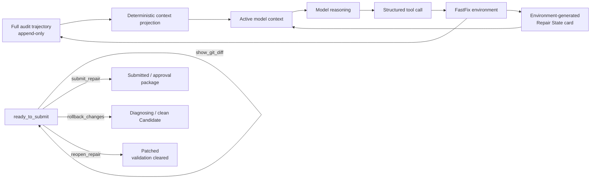

# FastFix 架构与安全边界

## 1. 设计目标

FastFix 面向 Python/FastAPI 仓库中的垂直修复任务，目标不是让 Agent 获得尽可能大的操作能力，而是建立一条可约束、可验证、可审批和可追溯的修复路径：

1. Agent 通过结构化工具理解和修改仓库，不获得任意 shell。
2. 所有修改发生在隔离 Candidate，canonical source 在审批前保持不变。
3. validation 必须覆盖报告缺陷、完整测试 scope 和完整 Ruff scope，并绑定同一 Git revision。
4. 只有经过人工 Approve 的 package 才能应用；Reject 和 rollback 都有明确语义与审计记录。
5. 冻结评测使用 protocol snapshot、attempt lease、原子结果发布和 source manifest，防止版本漂移、重复运行或证据静默替换。

## 2. 非目标

- 不是通用 Coding Agent 或交互式 IDE。
- 不声称覆盖任意语言、框架或仓库。
- 不把测试通过等同于完整业务语义等价。
- 不自动绕过人工审批。
- 不把开发阶段合成任务结果表述为公开 Benchmark、SWE-bench 或生产成功率。
- 不在运行时修复 Provider、Docker、宿主机或依赖供应链本身。

## 3. 模块架构

| 模块 | 责任 |
| --- | --- |
| `src/fastfix/agents` | 基于 mini-SWE-agent loop 的 diagnosis/repair Agent，以及 repair active context projection |
| `src/fastfix/models` | tool-call 响应解析与模型适配 |
| `src/fastfix/environments` | 工具执行环境、调用历史、repair state/card 同步与 ready/submit gate |
| `src/fastfix/tools` | 仓库读取、FastAPI 静态分析、受控编辑、Git diff、pytest、Ruff 和 rollback |
| `src/fastfix/repair` | repair phase、revision、validation、reopen 和 patch failure 状态 |
| `src/fastfix/workspace` | clean source 检查、Candidate 创建、所有权验证和清理 |
| `src/fastfix/sandbox` | local/Docker validation backend；冻结 Baseline 使用受限 Docker backend |
| `src/fastfix/approval` | approval package、manifest、Approve/Reject、应用记录与 reverse patch rollback |
| `src/fastfix/workflows` | Candidate → repair → validation → approval → apply/reject/rollback 的组合工作流 |
| `src/fastfix/security` | 路径策略、结果 bundle 的原子发布、可读性/哈希验证和 Windows ACL 修复 |
| `benchmarks/scripts` | protocol 校验、attempt lease、安全 runner、冻结 evidence 和 aggregate assessment |
| `tests/fastfix` | 单元、工作流、Docker、fixture、历史 evidence 与聚合口径验证 |

`src/minisweagent/` 是保留的上游主体，提供基础 Agent loop、模型/配置和通用运行能力；FastFix 增量集中在上表路径。归属基线见 `UPSTREAM.md`。

## 4. Agent Loop

`FastFixRepairAgent` 延用 mini-SWE-agent 简洁的循环控制，但其 environment 不接受任意命令字符串，而是接收模型产生的结构化 tool calls：

1. model 返回工具名与 JSON 参数；
2. `ToolRegistry` 查找显式注册的 `ToolSpec`；
3. Pydantic schema 拒绝多余、缺失或类型错误的参数；
4. handler 返回统一 `ToolResult`，包括 `ok`、`output`、`error_code` 和 bounded metadata；
5. `FastFixRepairEnvironment` 同步 Git changed files、revision、validation 与 patch failure 状态；
6. environment 把确定性 Repair State 状态卡附加到下一轮 observation；
7. `FastFixRepairAgent` 从 append-only `self.messages` 深拷贝并投影 active context，再调用 model；
8. 只有 `submit_repair` gate 满足时，Agent 才能结束为 `Submitted`。

这样设计的原因是把模型生成内容限制为有限协议：模型仍负责诊断和选择操作，但权限边界由 Python 代码而不是 prompt 约定执行。

以下三项均为冻结 FF-003—FF-015 之后的 post-freeze enhancement，没有参与原始 `11/13`，也没有触发历史任务重跑：

## 5. 工具分层

### 5.1 Read-only tools

`src/fastfix/tools/repository.py` 提供：

- `show_tree`：稳定排序、深度与条目上限、忽略 cache；
- `read_file`：UTF-8、行号、范围与最大行数；
- `search_code`：glob、大小写和结果数量限制。

`src/fastfix/tools/fastapi.py` 提供可选的 route 静态分析。它使用 Python AST，不导入或执行目标应用。

### 5.2 Controlled editing tools

`src/fastfix/tools/editing.py` 提供：

- `replace_text`：要求 old text 的实际命中数等于 `expected_occurrences`，先构造修改再原子替换；
- `apply_patch`：拒绝绝对路径、路径逃逸、测试文件、超范围文件、rename/header 不一致、过多文件或过大 patch；
- `show_git_diff`：返回 bounded Git diff；
- `rollback_changes`：用当前 patch 的 reverse apply 恢复 Candidate。

Git 子进程以参数列表和 `shell=False` 执行。每次成功编辑都会递增 revision、清空旧 validation，并同步实际 `git diff --name-only`；无实际 diff 的操作不会伪造修改状态。

### 5.3 Validation tools

`src/fastfix/tools/validation.py` 把 pytest 与 Ruff 限制在允许的参数集合：

- targeted pytest 必须显式给出至少一个 target；
- regression 使用配置的完整 tests scope，拒绝用子集冒充完整回归；
- Ruff 必须覆盖配置的完整 source scope；
- 参数注入、路径逃逸、超时和过长输出都返回结构化错误或 bounded observation。

## 6. Workspace 与 Git revision

`src/fastfix/workspace/candidate.py` 在创建 Candidate 前要求 source：

- 是有 HEAD 的 Git 仓库；
- tracked、staged、untracked 状态均 clean；
- 不包含被 tracked 的敏感文件；
- Candidate 目标不位于 source 内且尚不存在。

Candidate 从固定 source HEAD clone，处于 detached HEAD，并记录 source branch/HEAD 和 manager ownership marker。忽略文件不会随 clone 复制，因此本地 `.env`、cache 和 runtime 不会自然进入 Candidate。

`RepairSessionState` 用单调递增的 `revision` 表示 Candidate 语义版本，并用 `validation_epoch` 表示同一 revision 内的验证周期。targeted、regression 和 Ruff 同时绑定 revision 与 epoch；任一新 patch、rollback 或 reopen 都使旧结果失效。该机制防止“先验证、后修改、仍提交”，也防止 reopen 后复用同 revision 的旧 validation。

### 6.1 Post-freeze Ready lock 与状态卡

当非空合法 Diff 的当前 revision 已通过 targeted、完整 regression 和完整 Ruff 后，phase 进入 `ready_to_submit`。单一确定性动作策略同时服务于状态卡和执行层；此时只有 `show_git_diff`、`submit_repair`、`rollback_changes`、`reopen_repair` 合法。read/search/route inspection、重复 validation 和任何编辑都会以 `repair_ready_locked` 拒绝，且不会改变 Candidate、revision 或 validation。

`reopen_repair` 要求非空 reason，只能从 ready 状态调用。它保留当前 Diff 和 revision，递增 validation epoch，清除三个 validation 结果，记录 reopen 次数、原因、前后 epoch 与审计历史，再回到 `patched`。后续编辑仍通过既有机制增加 revision 并清空 validation。approval request 与 validation summary 序列化当前 epoch；manifest 覆盖二者，验证时还会交叉核对 revision、epoch、reopen count 与 sandbox 信息。

Repair State 状态卡由 environment 生成，包含 revision、validation epoch、phase、changed files、三个 validation 的 `current`/`missing`/`stale` 状态、合法动作、ready lock、patch failure、最近编辑错误和 reopen 次数。卡片不含绝对路径、凭据或长日志，并在 environment `serialize()` 中保留最新结构化版本。

### 6.2 Post-freeze Context Projection

完整 `self.messages` 仍按 `mini-swe-agent-1.1` append-only 保存并原样写入 trajectory。每次 model query 前，FastFix Agent 对历史做深拷贝，在副本上确定性压缩已更新、重复或旧 revision 的长 tool output；assistant tool call 与 tool result 的位置和 ID 配对不变。system、初始任务、最新状态卡、最近轮次、当前 revision validation、最新 Diff、最近失败以及相关文件最近一次 read 都保留。

投影不调用额外 LLM、Provider、tokenizer、向量检索或长期记忆。每轮用 JSON 序列化字符数记录 raw/projected/omitted chars、压缩消息数、上限与 reduction ratio；发送前显式校验 tool-call ID 的成对、顺序与唯一性。汇总同时区分累计量、逐轮最大值、平均值和超限次数，完整 trajectory 不被这些统计替代。若旧 validation 为保持工具协议必须留在 active context，只能以明确的 `stale/omitted` marker 出现。必要证据优先于字符上限，超过上限会被计数而不会静默裁剪。

## 7. Validation scope

提交条件不是“运行过命令”，而是同时满足：

- Git diff 非空；
- changed files 全部位于 allowed source paths；
- targeted pytest 对当前 revision 有成功结果；
- regression pytest 对当前 revision 成功且 `scope_complete=true`；
- Ruff 对当前 revision 成功且 `scope_complete=true`；
- validation metadata 中的实际 scope 与 environment 配置一致。

冻结 Baseline 的默认 fixture scope 是 `app` 与 `tests`。这只能证明冻结 fixture 在这些检查中的行为，不能证明完整运行时语义；FF-014 amendment 就保留了这一区别。

## 8. Docker sandbox

`src/fastfix/sandbox/docker.py` 使用 Docker CLI 创建一次性验证容器，关键参数由代码和 `tests/fastfix/sandbox/test_docker.py` 固定：

- `--network none`
- `--read-only`
- `--cap-drop ALL`
- `--security-opt no-new-privileges=true`
- `--pids-limit 128`
- `--memory 512m` 与 `--memory-swap 512m`
- `--cpus 1.0`
- `--user 65532:65532`
- Candidate 只读挂载到 `/candidate`
- 仅 `/tmp` 和 pytest cache 使用受限 tmpfs

验证 runner 只接受 `pytest` 或 `ruff` 及参数数组，把结果写成 JSON；host 读取后限制输出大小并保留 timeout/OOM/protocol metadata。容器最终必须清理，cleanup failure 会使本次 validation 失败。

只读 mount 与 rootfs 意味着测试不能修改 Candidate；测试如需写入，只能使用明确 tmpfs。Docker daemon 仍是宿主机高权限组件，镜像内容也属于需要人工管理的信任边界。

## 9. Approval package

`src/fastfix/approval/package.py` 在 Candidate 完成 submit gate 后：

1. 重新读取 source/Candidate HEAD 和 clean state；
2. 验证 Candidate 基于记录的 source HEAD；
3. 提取 patch 和 changed files；
4. 校验 patch 与 repair state 的 revision/validation 一致；
5. 生成 approval request、validation summary、patch 和 SHA-256 manifest；
6. 再次读取 package 验证 manifest 与 schema。

package 是人工决策的固定输入，避免 reviewer 审阅的 diff 与随后应用的 diff 不一致。

## 10. Approve、Reject 与 rollback

`src/fastfix/approval/actions.py` 把决定与应用分开记录：

- Reject：记录 decision，清理 Candidate，不修改 source。
- Approve：验证 request/package/Candidate/source 一致性，再应用 patch；记录应用前后 HEAD、patch 哈希和审计路径。
- Apply failure：尝试恢复 source；无法证明恢复成功时明确返回 failure，不把部分状态报告成成功。
- Rollback：只对已记录 application 操作，验证当前 source 仍匹配 application 后状态，再应用 reverse patch 并记录结果。

Approve/Reject 都要求显式 actor 与 request id。冻结 FF-003—FF-015 没有 Apply；成功 Candidate 在 run 结束时 pending，随后 Reject。

## 11. Protocol snapshot

`benchmarks/scripts/run_task_baseline.py` 校验 protocol schema、task commit 与 system commit：

- commit 必须存在；
- task 路径必须匹配 `task_commit` 中的冻结内容；
-系统路径必须匹配 `system_commit` 中的冻结内容；
- task id、fixture、result 路径和 run policy 必须符合协议。

这不是普通运行时 revision，而是评测的可复现性边界：任务定义、Gold、fixture、Agent 系统和 runner 版本被固定到 Git 对象。若 snapshot 漂移，runner 在 Provider 调用前失败。

## 12. Attempt lease

同一任务的 `run-001` 必须是一次性 attempt。`run_task_baseline.py` 通过独占创建目录和 `lease.json` 获取租约：

- 第一个进程成功，竞争进程得到 `run_already_attempted`；
- lease 绑定 protocol path/hash、task/system commit、task id 和 attempt id；
- preflight 或 Provider 失败也保留 lease，不能用失败作为重跑理由；
-损坏 lease 不会被覆盖，而是阻断并要求人工检查；
- 不同 task/attempt 使用不同 lease 路径。

因此“inspect”是读状态，“run”才会消耗 lease；冻结 `run-001` 只能读取，不能重跑。

## 13. Result publication

`src/fastfix/security/result_publication.py` 将临时 result bundle 发布为最终目录：

1. 在目标旁独占创建 publication state；
2. 核对预期文件集合并为每个文件计算 SHA-256，JSON 必须可解码；
3. 用 `os.replace` 发布整个目录；
4. Windows 上运行参数数组形式的 `icacls <path> /inheritance:e /t /c`；
5. 从最终目录重新枚举、读取并核对 hashes；
6. 成功后删除 publication state。

若 ACL 修复或验证失败，已发布目录会移动到隔离名称，并留下失败状态。inspect 把残留 state 视为 incomplete，不会把不可读结果当作完整 evidence。

## 14. Benchmark evidence

`benchmarks/scripts/build_aggregate_assessment.py` 的 source of truth 是冻结单题：

- protocol；
- assessment；
- summary/validation/changed files/patch；
- approval request；
-必要的 `metrics-erratum.json` 或 `assessment-amendment.json`。

脚本校验 source manifest 的 SHA-256 后，生成：

- `benchmarks/results/aggregate-assessment.json`
- `benchmarks/results/aggregate-assessment.md`

主结果固定为 `development_validated_candidate_rate = 11/13 ≈ 84.6%`。JSON 同时声明 `formal_benchmark=false`、`metric_eligible=false` 和 `performance_conclusion=null`。FF-007 Provider 混杂排除视图仅为 post-hoc sensitivity analysis，不能替代主结果。

`build_post_freeze_mechanism_assessment.py` 另行运行 DeterministicToolcallModel、scripted Agent、RecordingValidationBackend 和临时 Git Candidate，生成 `post-freeze-mechanism-assessment.json/md`。该产物声明 `evaluation_role=post_freeze_scripted_mechanism_evaluation`、`formal_benchmark=false`、`metric_eligible=false`、`provider_calls=0`、`frozen_run_001_replayed=false`，不修改 aggregate assessment，也不与 `11/13` 合并分母。

## 15. 关键安全边界

| 风险 | 控制 | 剩余风险 |
| --- | --- | --- |
| Prompt 指示执行任意命令 | 无 shell、显式工具 registry | 模型仍可能选择不合适但 schema 合法的操作 |
| 读取凭据或逃逸仓库 | 相对路径、allowed roots、敏感文件和 symlink 检查 | 已被错误 tracked 到普通文件的秘密仍需发布扫描 |
| 修改测试以“通过” | allowed source paths 与 test path 禁止规则 | source 逻辑仍可能针对测试过拟合 |
| 使用陈旧验证 | revision-bound validation | 测试覆盖不足仍会漏掉语义问题 |
| 直接污染 source | Candidate 隔离、审批前 source clean/HEAD 检查 | Approve 是有意写操作，仍需 reviewer 判断 |
| Docker 内网络/提权 | no network、只读、非 root、cap/resource 限制 | Docker daemon、镜像和内核是外部信任边界 |
| 重跑污染评测 | protocol snapshot 与 attempt lease | lease/runtime 目录仍需可靠保存 |
| 结果目录部分发布或不可读 | 原子替换、manifest、ACL 修复、quarantine | 文件系统/ACL 极端故障需要人工恢复 |
| 历史指标错误 | immutable evidence + amendment/erratum | amendment 只能限定解释，不能创造缺失证据 |

## 16. 已知限制

- 当前证据只覆盖 FF-003—FF-015 的 13 个合成任务。
- `run_fastfix_secure.py` 和 Baseline guard 仍位于 `benchmarks/scripts`，没有稳定的 FastFix distribution CLI。
- Provider failure 与 Agent closure failure 需要分别解释；单次运行不能分离所有因果因素。
- Context Projection 是规则驱动的字符级机制，不是语义摘要；必要上下文本身超过上限时会优先保留必要证据。
- regression/Ruff 完整性是相对 fixture 配置而言，不是对仓库所有可能行为的证明。
- reverse patch 依赖 source 仍处于已记录 application 状态；后续人工改动会主动阻断自动 rollback。
- Windows 历史 evidence 含本地绝对路径；冻结文件不应原地改写，发布策略见 `docs/publication-checklist.md`。
